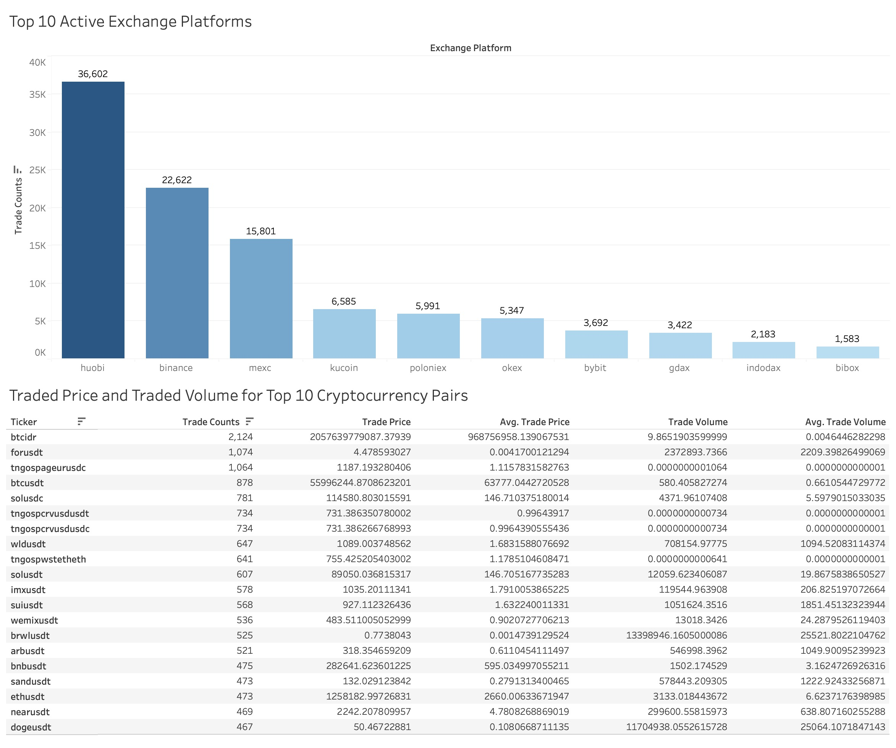
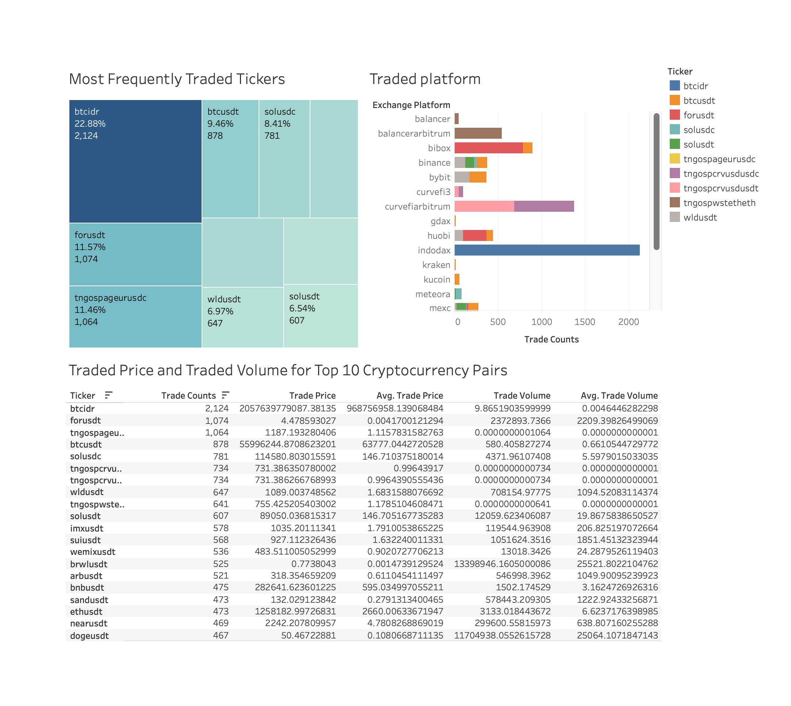

# Real-time Crypto Transactions Streaming Data Engineer Project
## Table of Contents
- [Introduction](#introduction)
- [Architecture](#architecture)
- [Technologies Used](#technologies-used)
- [Data Source](#data-source)
- [Highlighted Features](#highlighted-features)
- [How to Run](#how-to-run)
- [Contact](#contact)

## Introduction
This project demonstrates a real-time streaming data pipeline designed to capture cryptocurrency transactions from major exchange platforms. Leveraging cutting-edge technologies such as Apache Kafka, Apache Spark, AWS, and Airflow, the system is capable of processing over 200 transactions per second, offering scalable, fault-tolerant solutions for handling cryptocurrency data in near real-time.

## Architecture


This project consists of several critical components that work together to ensure real-time streaming and processing of crypto transactions:

- **Data Source**: Using the Tiingo API to generate cryptocurrency data streams.
- **Apache Airflow**: Orchestrates and schedules the entire pipeline, ensuring seamless data ingestion and storage in PostgreSQL.
- **Apache Kafka**: Streams data between various services in a distributed and fault-tolerant manner.
- **ZooKeeper**: keeps track of status of the Kafka cluster nodes and it also keeps track of Kafka topics, and partitions.
- **Control Center and Schema Registry**: Helps in monitoring and schema management of our Kafka streams.
- **Apache Spark**: Processes large volumes of data across its distributed nodes.
- **AWS S3**: Final storage for processed data, providing scalability and accessibility.

## Technologies Used
The project leverages a variety of industry-standard tools and platforms, including:

- **Python**: Core language for scripting and data manipulation.
- **Apache Airflow**: Task orchestration and scheduling.
- **Apache Kafka**: Distributed event streaming platform.
- **Apache Zookeeper**: Coordination service for managing Kafka nodes.
- **Schema Registry**: Ensures schema consistency in Kafka.
- **Apache Spark**: Distributed data processing.
- **Docker**: Containerization for seamless deployment.
- **AWS S3**: Cloud storage for processed data.
  
## Data Source
- Tiingo API: Provides real-time cryptocurrency transaction data, covering over 8,000 tickers from major exchange platforms. [Learn more](https://www.tiingo.com/).

## Highlighted Features
- **Real-Time ELT (Extract, Load, Transform)**: Achieved near real-time data ingestion, processing, and storage into AWS S3.
- **Scalability**: Handles over 200 transactions per second, with the ability to scale dynamically based on transaction load.
- **Distributed Synchronization**: Implemented a multi-broker Kafka cluster with data replication to ensure durability and prevent data loss.
- **Pipeline Orchestration**: Apache Airflow orchestrates the pipeline, scheduling tasks for continuous data flow and processing.
- **Schema Management**: Employed schema registry for managing Kafka stream schemas, ensuring data consistency and compatibility across different services.

## Results
#### Sample Output
Based on a 10-minute test run, 113,125 transactions have been successfully extracted, transformed and loaded. 
The following screen shot shows the transformed csv file:


#### Data Field Explained
- trade_id: Randomly generated string to identify each transaction.
- ticker: A short combination of letters representing a cryptocurrency pair between which the transaction is traded. e.g. Ticker "btcusdc" reprents transaction traded "btc" for "usdc".
- date: A string representing the datetime this trade quote came in.
- exchange_platform: The exchange of the trade was done.
- trade_volume: The amount of crypto volume done at the trade price of the traded-in cryptocurrency. 
- trade_price: The price the trade was executed at.

#### Visualization 

<br>
This bar chart illustrates the top 10 Exchanges with the most transactions.
<br>
<br>

<br>
- This dashboard indicates the top 10 frequently traded tickers and their trade statistics. 

<br>
- This dashboard provides an overview of transactions executed on specified exchange Huobi, including total transaction counts, traded tickers Proportion and trade statistics for each ticker
## How to Run

1. Clone the repository:
    ```bash
    git clone [https://github.com/MengshaLiu/realtime-crypto-data-streaming-DE.git]
    ```
2. Nevigate to the project directory and Run Docker Compose to spin up the services:
    ```bash
    docker-compose up -d
    ```
3. Monitor your pipeline using the Airflow UI and Kafka’s Control Center.
   
## Contact
For any questions or collaborations, feel free to reach out via:
- LinkedIn(https://linkedin.com/in/melissa-liu-b31892180)
- GitHub: (https://github.com/MengshaLiu)

This enhanced version includes a cleaner structure, highlights key outcomes, and emphasizes the project’s scalability and features. Let me know if you’d like further modifications! 
